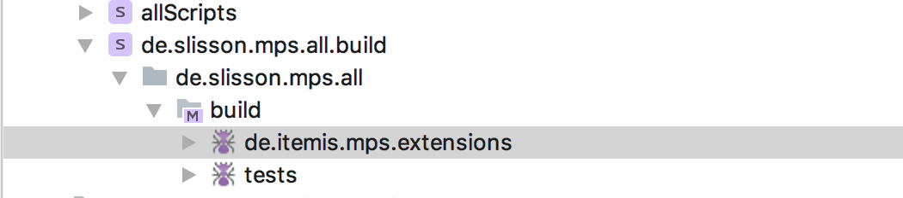
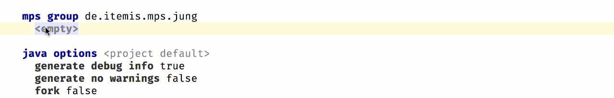

# Migrating an Extension from the mbeddr Platform

There are two different kinds of migrating a extension from the mbeddr platform to the MPS-Extensions:

1. The extension already exists as a separate plugin in the mbeddr platform 
2. The extension is currently part of the big `com.mbeddr.mpsutil` plugin

A list of the first (easier) to migrate extension is [here](https://github.com/JetBrains/MPS-extensions/labels/migration).

Migrating extension of that list is pretty straight forward:

### Check the Dependencies

First of all check if all dependencies are already migrated to this repository. If you not you can't migrate the extension. To do so open the `com.mbeddr.build` [project](https://github.com/mbeddr/mbeddr.core/tree/master/code/languages/com.mbeddr.build) in the mbeddr repository. Click the link in the issue that is related to the extension to select the corresponding plugin in the build script. 

You will see something like this:

```
idea plugin com.mbeddr.mpsutil.jung 
  name com.mbeddr.mpsutil.jung 
  short (folder) name com.mbeddr.mpsutil.jung 
  description <no description> 
  version ${mbeddr.version} 
  << no vendor >> 
  content: 
    group.jung 
  dependencies: 
    jetbrains.mps.core 
  << ... >> 
```

First of all check the `dependencies` section of the plugin if it contains plugins that start with `com.meddr` then it still has dependencies and cannot be moved. Though you might want to move the plugin it depends. 😉

### Move the Files

If all dependencies are already part of the MPS-extensions we can start with migrating the extension. Follow the reference(s) in the content section. `group.jung` in this case:

```
mps group group.jung 
  solution com.mbeddr.mpsutil.jung.pluginSolution 
    load from $mbeddr.github.core.home/code/languages/com.mbeddr.mpsutil/languages/com.mbeddr.mpsutil.jung/solutions/pluginSolution/com.mbeddr.mpsutil.jung.pluginSolution.msd 
   
  language com.mbeddr.mpsutil.jung 
    load from $mbeddr.github.core.home/code/languages/com.mbeddr.mpsutil/languages/com.mbeddr.mpsutil.jung/com.mbeddr.mpsutil.jung.mpl 
```

Both of modules in the plugin are located under the `code/languages/com.mbeddr.mpsutil/languages/com.mbeddr.mpsutil.jung` directory. 

The first thing to do is create a folder in the MPS-extensions repository where we can place these files. This folder should be placed in under the `code` directory of the MPS-Extensions repository. The naming convention is that it shall contain the last name of the *namespace*. In this case `jung`. 

All the files from the mbeddr repository `code/languages/com.mbeddr.mpsutil/languages/com.mbeddr.mpsutil.jung` are copied over to `code/jung/lanugages` in the MPS-extensions repository.

The structure in the MPS-extensions repository slightly differs from the one in mbeddr. That requires an additional step. Some languages contain a dedicated `solutions` folder next to the language. We don't use this kind of file layout in the MPS-extensions repository. In theses cases the file from `code/jung/lanugages/solutions` need to get moved to `code/jung/solutions`.

*Sounds too complicated? Don't worry we will help you when sent the pull request to get it right.* 😉

### Adding the Files to the Project

The files need to be part of the MPS project to show up in MPS. This is done by adding them to the project path:


And then selecting the before copied files: 


The files end up in no folder in the project by default. They should be placed in a virtual folder of the project matches subfolder in `code`. In this case `jung`:


After this is done the last step that is missing is adding the plugin to the build.

### Adding it to the Build

To build plugin that was moved it needs to beb part of the build scripts. These scripts are located under the `build` folder of the project. The solution of interest is `de.itemis.mps.extensions.build`. And then the `de.itemis.mps.extensions` build project:



The first thing required is a group where all the implementation modules of the plugin are places. Tests are placed in a different script. The group is named similar to the mbeddr group name but the prefix is not `com.mbeddr.mpsutil` but `de.itemis.mps`. In this case this results to `de.itemis.mps.jung`. This group then contains all the the solutions and languages of the plugin:



After the group is created a `idea plugin` is required. This plugin references the group and should be placed right above the group in the build script. This is very important to keep the build script maintainable. 


The final step is adding the plugin to the layout section of the build project. 


After adding the plugin to the layout it should be possible to build the model. But in most cases a error like this will be shown:

```
cannot build relative path to `wstx-asl-3.2.6.jar': No such path in local layout
-- -- was input node: [path] BuildSourceMacroRelativePath null[8622958246116067669] in de.itemis.mps.extensions.build@5_1
-- was template node: r:54537613-52b5-40a8-b223-e87f0960b04f(jetbrains.mps.build.mps.generator.template.main@generator)/4743026300739052425
```

This error message means that some jar files that are used by the language or some solution are missing. The convention here is to create a `lib` folder in the plugin and include the required `jar` files. These files are usually contained in a `lib` folder. 


### Sending the Pull Request

To verify that everything works correctly run:

```bash 
./gradlew test # mac OS / Linux

gradlew.bat test # Windows
```

This command should finish successfully. After that please create pull request at out repository and label it with `migration`

*If something doesn't work out quite well or you are unsure what to do don't worry. You can still send the PR and somebody will guide you through the process.*

### Bonus

If you are really eager you can send a PR to the mbeddr platform repository that removed the plugin there. 