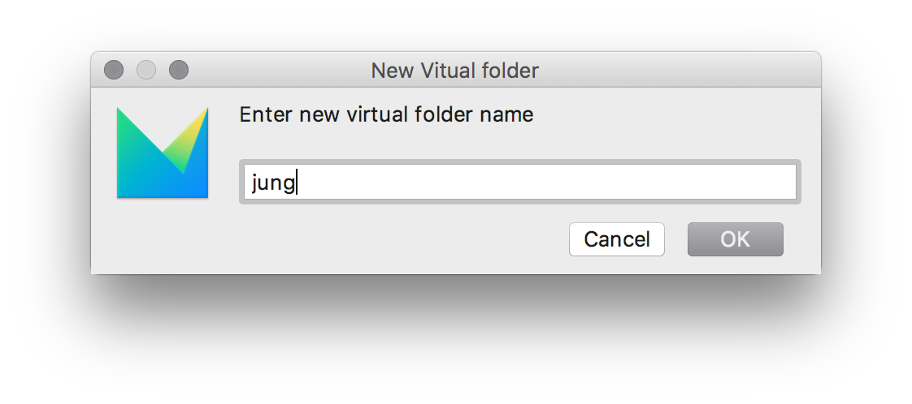

# Migrating an Extension from the mbeddr Platform

There are two different ways of migrating an extension from the mbeddr platform to the MPS-Extensions:

1. The extension already exists as a separate plugin in the mbeddr platform 
2. The extension is currently part of the big `com.mbeddr.mpsutil` plugin

A list of the first (easier) to migrate extensions is [here](https://github.com/JetBrains/MPS-extensions/labels/migration).

Migrating extensions from that list is pretty straightforward:

### Check the Dependencies


First of all, check if all dependencies of the extension to migrate are already migrated to this repository (https://github.com/JetBrains/MPS-extensions/). 
 - If not, you can't migrate the extension. 

How do you accomplish that? 

To check whether the target extension already has all its dependencies migrated:
1. Download the latest `mbeddr.core` code in the mbeddr repository: https://github.com/mbeddr/mbeddr.core.
2. Once downloaded, open the `com.mbeddr.build` project in MPS. 
  - The location should be ([your download folder]\mbeddr.core\code\languages\com.mbeddr.build).
3. Get the details of the target extension:
  i) Open the related github issue for the target extension.
    - For example, for the "querylist" extension, the URL of the github issue is: https://github.com/JetBrains/MPS-extensions/issues/23).
	ii) Inside the issue page, click the link that is related to the extension. 
    - The link normally starts with `http://127.0.0.1`.
		- For this example, the link is: http://127.0.0.1:63320/node?ref=r%3A742f344d-4dc4-4862-992c-4bc94b094870%28com.mbeddr.mpsutil.dev.build%29%2F7231064182705610173&project=com.mbeddr.build
	iii) Clicking that link will select the corresponding plugin entry in the build script in your open MPS project.

After doing the steps above, you will see something like this entry in MPS, in your open `com.mbeddr.build` project:

```
idea plugin com.mbeddr.mpsutil.jung 
  name com.mbeddr.mpsutil.jung 
  short (folder) name com.mbeddr.mpsutil.jung 
  description <no description> 
  version ${mbeddr.version} 
  << no vendor >> 
  content: 
    group.jung 
  dependencies: 
    jetbrains.mps.core 
  << ... >> 
```

The first thing you do is check the `dependencies` section of the plugin. If it contains plugins that start with `com.mbeddr` then it still has dependencies on mbeddr and cannot be moved. (You might want to move the plugin if you have the time. 😉 )

### Move the Files

If all dependencies are already part of the MPS-extensions, we can start with migrating the extension. Follow the reference(s) in the content section. `group.jung` in this case:

```
mps group group.jung 
  solution com.mbeddr.mpsutil.jung.pluginSolution 
    load from $mbeddr.github.core.home/code/languages/com.mbeddr.mpsutil/languages/com.mbeddr.mpsutil.jung/solutions/pluginSolution/com.mbeddr.mpsutil.jung.pluginSolution.msd 
   
  language com.mbeddr.mpsutil.jung 
    load from $mbeddr.github.core.home/code/languages/com.mbeddr.mpsutil/languages/com.mbeddr.mpsutil.jung/com.mbeddr.mpsutil.jung.mpl 
```

Both modules above are located under the `code/languages/com.mbeddr.mpsutil/languages/com.mbeddr.mpsutil.jung` directory. 

Steps to create a new extension:
1. Create a folder in the MPS-extensions repository where we can place these files. 
- This folder should be placed under the existing `code` directory of the MPS-Extensions repository. 
- The naming convention is that it shall contain the last name of the *namespace*. In this case `jung`. 
- The resulting folders therefore should be: `code\jung` and also `code\jung\languages`.

2. Copy all the files from the mbeddr repository `code/languages/com.mbeddr.mpsutil/languages/com.mbeddr.mpsutil.jung` to the new `code/jung/languages` in the MPS-extensions repository.

3. After copying, check if there is an existing `solutions` folder to the language you migrated such that you now have a `code/jung/languages/solutions` folder. If you do, move the files from `code/jung/languages/solutions` to the `code/jung/solutions` folder. This is because the structure in the MPS-extensions repository slightly differs from the one in mbeddr. 

4. Remember: you are copying from the `mbeddr.core` folder and pasting them to the `MPS-Extensions` folder.

*Sounds too complicated? Don't worry we will help you when sent the pull request to get it right.* 😉

### Adding the Files to the Project

The files need to be part of the MPS project to show up in MPS. This is done by adding them to the project path/modules:


And then selecting the copied files: 


The files end up in no folder in the project by default. They should be placed in a virtual folder of the project that matches the subfolder under the `code` folder. In this case `jung`:




After this is done the last step that is missing is adding the plugin to the build.

### Adding it to the Build

To build the plugin that was moved, it needs to be a part of the build scripts. These scripts are located under the `build` folder of the project. The solution of interest is `de.itemis.mps.extensions.build`. And then the `de.itemis.mps.extensions` build project:


The first thing required is a group where all the implementation modules of the plugin are placed. Tests are placed in a different script. The group is named similar to the mbeddr group name but the prefix is not `com.mbeddr.mpsutil` but `de.itemis.mps`. In this case this results to `de.itemis.mps.jung`. This group then contains all the solutions and languages of the plugin:


After the group is created, an `idea plugin` is required. This plugin references the group and should be placed right above the group in the build script. This is very important to keep the build script maintainable. 


The final step is adding the plugin to the layout section of the build project. 


After adding the plugin to the layout it should be possible to build the model. But in most cases an error like this will be shown:

```
cannot build relative path to `wstx-asl-3.2.6.jar': No such path in local layout
-- -- was input node: [path] BuildSourceMacroRelativePath null[8622958246116067669] in de.itemis.mps.extensions.build@5_1
-- was template node: r:54537613-52b5-40a8-b223-e87f0960b04f(jetbrains.mps.build.mps.generator.template.main@generator)/4743026300739052425
```

This error message means that some jar files that are used by the language or some solutions are missing. The convention here is to create a `lib` folder in the plugin and include the required `jar` files. These files are usually contained in a `lib` folder. 


### Sending the Pull Request

To verify that everything works correctly run:

```bash 
./gradlew test # mac OS / Linux

gradlew.bat test # Windows
```

This command should finish successfully. After that please create pull request at our repository and label it with `migration`

*If something doesn't work out quite well or you are unsure what to do, don't worry. You can still send the PR and somebody will guide you through the process.*

### Bonus

If you are really eager you can send a PR to the mbeddr platform repository to remove the plugin there. 
