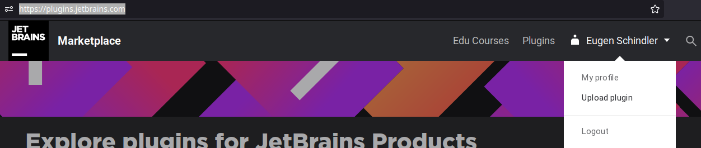

# Adding a new MPS Extension

If you want to add a new (or earlier developed existing) extension to MPS Extensions, the guidelines described here should help you.
Note: the process of adding a new plugin is very similar to the process of [migrating](migrating.md) (which is very well-documented). This text repeats some of these steps less rigorously and adds all the steps needed for a new plugin.
Note2: if you add a new extension, all this extension's code will be licensed under Apache 2.0 license.

## Check if a new extension is really needed

If you have functionality that may already fit well under an existing extension, consider merging your extension's functionality into that existing extension. If the functionality of the extension you want to add doesn't fit under any of the existing extensions, and you know well where and how you want to add the extension, you can just open a pull request that adds your new extension (but please observe the [checklist](#checklist-for-adding-a-new-extension)).
If you are unsure how or where to start, you can open an issue and discuss/ask via that issue.

## Checklist for adding a new extension

This checklist explains what you have to do to add a new extension fully and properly to the MPS Extensions.

### Copy your extension into the repository and add to the MPS project
We assume that you have developed the extension you want to add in its own MPS Project. If not, you should first isolate it and make sure that it can work by itself. If your extension has dependencies to one of the plugins in MPS Extensions, you could either get this dependency from a Maven repository (like Itemis Nexus) or develop the extension in its entirety in a fork of MPS Extensions.
If you want to develop your extension from scratch in a fork, you can just skip this section and add the (plugin) solution(s) and/or language(s) that comprise your extension directly to the MPS project that lives under the `code` folder.

Before you start, make sure that you have clean MPS models (without any classes_gen and source_gen folders).
To copy or start your extension in the right place in the repository:

- Create a subfolder with the name of your extension under the `code` directory: `code/<extension_name>`, e.g. `code/plaintextgen` for the already existing plaintextgen extension and copy the folders languages (if any) and solutions (if any) of your new extension to `code/<name>`. See section _Move the Files_ under [migration](migrating.md) for more detailed instructions.
- Open the MPS project living under the `code` folder, add the languages and solutions of your extension to it, and group all the added solutions and/or languages in a virtual folder that has the name of your extension. See section _Adding the Files to the Project_ of [migration](migrating.md) for more detailed instructions.
- In order to have proper license information in a custom version of MPS with the MPS Extensions included (soon to be downloadable from the JetBrains MPS site), add an `about.txt` file under the root of your extension's folder (similar like the plaintextgen has an `about.txt` under `code/plaintextgen/about.txt`). If your extension doesn't depend on any external software, you can indicate that in the `about.txt` (see the example of plaintextgen). If you are using third-party libraries or other software, the `about.txt` must attribute the licenses of this third-party software (an example of such attribution can be found in the [about.txt of MPS itself](https://github.com/JetBrains/MPS/blob/master/about.txt)).

### Add to build solution
This step is needed so that your extension is built into a plugin and deployed to Maven repositories (like Itemis Nexus or mbeddr github packages), the JetBrains plugin repository, and the MPS download with MPS Extensions included.
Detailed instructions can be found in section _Adding it to the Build_ of [migrating](migrating.md), but below are some extra steps you need to observe with a new extension:

* In order to allow for automatic uploading to the JetBrains plugin repository, make sure you fill in the fields `description`, `version`, and `vendor` properly in the `idea plugin` section of the build script. Don't leave them empty!
* To package the `about.txt` with the plugin artifact, add a `file` entry to the `plugin` section of your extension's plugin(s). As an example, we show the `about.txt` file entry of plaintextgen:
* 

### Make a pull request
Please refer of section _Sending the Pull Request_ of [migrating](migrating.md) for detailed instructions, but skip the last part about the `migration` label.

### Manually upload a build of your extension's plugin(s) to the JetBrains plugin repository

!!! info "This step is not required anymore as most people get the extensions from one of the Maven repositories."

Because the upload of a new plugin to the JetBrains plugin repository has a manual quality check step, you need to upload the plugin(s) of your extension the first time manually. After you have done this, an automated deployment process at JetBrains will completely take care of automatic deployment of new versions (upon migration to newer MPS versions) to the plugin repository.
To manually upload your plugin(s) (assuming that you have executed the `./gradlew` (or `gradlew.bat`) build step as part of integrating into the build as instructed in the previous section), do the following:

- Edit the `plugin.xml(s)` of your plugin(s) artifact(s) (e.g. for plaintextgen that is `artifacts/de.itemis.mps.extensions/com.dslfoundry.plaintextgen/META-INF/plugin.xml`) to include idea_version: add a tag to the plugin.xml(s) that reads:
  `#!xml <idea-version since-build="$current_mps_build" until-build="$next_mps_build" />`, where `$current_mps_build` and `$next_mps_build` are formatted based on the MPS version: if your MPS version is `LCDY.V.S` (where L=millennium, C=century, D=decade, Y=year, V=major version in year, and S=minor version), then the build is `DYV.S`. So for MPS 2021.1.1, the idea_version tag would look as follows:
  `#!xml <idea-version since-build="211.1" until-build="212.1" />`
  
- Compress the folder(s) of your plugin(s) into zip(s), e.g. for plaintextgen, the folder `artifacts/de.itemis.mps.extensions/com.dslfoundry.plaintextgen` must be zipped into `com.dslfoundry.plaintextgen.zip`

- Upload the zip file(s) to [the JetBrains plugin repository](https://plugins.jetbrains.com/) (if you haven't already, you need to create a JetBrains account for this):

    - Set license to `Apache 2.0`: 
    - Set tag to `MPS`: 
- After upload, press `Edit Section` of your newly uploaded plugin: 
  
- Then add author `MPS extensions` (if you want you can remove yourself as author):
