# Diagrams

**Language Namespace :** `de.itemis.mps.editor.diagram`

## General

The `de.itemis.mps.editor.diagram` language enables graphical editing of models in JetBrains MPS. It allows users to visualize textual models as diagrams, providing a more intuitive way to interact with data. Diagrams consist of blocks (boxes) and connectors (lines), which represent nodes and relationships in the underlying model.

## Diagram Cells

Add a new `diagram` cell to the editor to add a new diagram to the editor. The cell supports the following properties:

- *id* is an identifier for the diagram. It can be node or a string. In the first case, the identifier is derived from the 
   node ID. The identifier is necessary in cases where you have multiple (sub-)diagrams for the same node.
- *content* allows defining the actual content of the diagrams (boxes, edges, attributes etc.). It is explained in the next section.
- *connection creators* are used to create connections between diagram elements like ports and boxes. A list of type `IConnectionType` has to be returned from this method. The default implementation is `SNodeConnectionType` which has two 
 methods `canCreate(node<> fromNode,string fromPort,node<> toNode,string toPort)` and `create(node<> fromNode,string fromPort,node<> toNode,string toPort)` which have to be overridden.
- *palette entries* creates the entries for the `Diagram Palette` tool located on the right side of the editor.
- *palette folder* creates the folder inside the `Diagram Palette` tool
- *buttons* creates the buttons that are visible at the upper left corner of the diagram and when selecting edges/boxes.
- *layout algorithm* selects the layout algorithm to be used by the auto layouting functionality.
- *default shape* declares the default shape of boxes.
- *owner change handler* are invoked when diagram elements should be moved to a different sub-diagram. The *can change* methods checks if the element can move and the *change* method is responsible for moving the elements.
- *autolayout on init* runs the ELK layouter on the diagram when the editor containing the diagram is opened and no layout is saved in the model.
- *autolayout on change* runs the auto layouter whenever the diagram model changes (e.g. connecting two ports, adding a new item from the palette). The only exception are manual layout changes like resizing or moving a box that don't trigger it.
- *fit size on init* changes the size of all boxes in the diagram to only take up the minimum required size when the diagram is opened.
- *save subdiagram layout in this diagram* stores the layout information in the root diagram instead of the node of the sub-diagram.
*save layout data* saves the layout data (position/siz/visibility of diagram elements) in the node of the diagram inside the attribute [layoutMap](http://127.0.0.1:63320/node?ref=r%3A9a28b49a-e98c-4186-a7e1-7e782b3f4fc3%28de.itemis.mps.editor.diagram.layout.structure%29%2F8963411245960991886). If you disable this option you might want to enable autolayout on init instead.
- *connect boxes without dummy ports*: boxes are connected directly without invisible ports. This option could have an effect on the layouting of the diagram related to hyperedges. Those are edges that are created when multiple edges are merged into one edge.
- *disable node editing* removes the ability to edit MPS cells inside diagrams when you double-click on them.
- *synchronize diagram with model only on opening* makes the diagram not update itself automatically based on the model. The new diamond-shaped button has to be used to do this. The only time when the diagram is synchronized is when the diagram is initially initialized e.g. when creating the editor for a root node. The use case for this feature is that sometimes you want to edit the model in bulk before updating the diagram which can take a lot of time and disturb the editing experience.
- *ignore elements' minimum size restriction (indent layout)* allows boxes to set a new required minimum size through the style attribute *diagram-layout-node-size-minimum*.
- *show grid* lays a grid over the diagram that can be used for aligning and snapping elements to the grid.
- *grid size* defines the size of the grid in pixels.
- *grid color* defines the color of the grid.
- *grid style* sets the style of the grid: cross, dashed, dot or line.
- *arrow key move* defines the amount an element is moved when pressing an arrow key.
- *arrow key move amount (slow)* defines the amount an element is moved when pressing shift and an arrow key.
- *arrow key pan amount* defines the amount the diagram is panned when pressing an arrow key.
- *arrow key pan amount (slow)* defines the amount the diagram is panned when pressing shift and an arrow key.
- *minimum scale*: sets the minimum scaling factor when zooming out of the diagram.
- *use grid snapping* activates automatically aligning elements to the grid.

To use the node of the editor itself somewhere, use the expression `thisNode`. Diagrams can also be embedded into collapsible cells of the language *de.itemis.mps.editor.collapsible*.

### Shapes

Shapes specify how diagram elements are rendered (excluding the MPS editor cells). Create a new shape definition. It supports the following options:

- *default size*: returns the size of the shape in pixels if the size is not calculated through other means such as contained editor cells.
- *parameters* are additional variables than can be set when instantiating a shape and used inside shape definitions.
- *draw(graphics,bounds, style)* is the method that draws the shape.
  The shape has to be inside the dimensions of the *bounds* parameter.
  In case it is used as the end of an edge, the edge always points from left to right and is connected to the shape at the left center of the *bounds*. Read the [Oracle 2D Graphics documentation](https://docs.oracle.com/javase/tutorial/2d/TOC.html) to learn more about painting with Java Swing. The *style* parameter are internal shape style classes that implement *IShapeStyle_Internal*. The default implementation is *BasicShapeStyle* but there are special classes for diagram elements like edges or markers.
- *draw shadow* draws a drop shadow around the shape by default. It can be customized through this method.
- *get shape* can be used instead of the draw and draw shadow methods to customize the drawing even further.

### Diagram Palette

You can drag elements from the palette to the diagram. The tool itself also supports folders similar to the context actions tool.

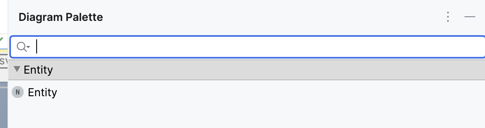{ width="800" }

Palette entries can be fined inside diagram cells. You have to return a `SubstituteInfo` instance that can be created through the helper variable `factory` that has various methods for creating substitute info instances such as for children of a concept.

The palette folder can be declared at the same place. The parameter `node` refers to the node of the editor itself, `concept` and `targetNode` come from the created substitute info instance.

### Buttons

There are many different buttons that are either visible in the upper left corner of the diagram or when boxes/edges are selected. Some buttons are not visible in sub-diagrams. By default, all buttons are enabled. There are two ways to customize the buttons. In *button configurations* the predefined buttons can be toggled and in *custom configurations* you can create your own buttons. The following buttons are available:

- *Layout Diagram* runs the auto layouter for the diagram.
- *Maximize Diagram* maximizes th diagram to the full size of the editor.
- *Reset View* resets all changes to the diagram view like zooming and translations.
- *Zoom In* zooms into the diagram (shortcut: alt+shift+minus).
- *Zoom Out* zooms out of the diagram (shortcut: alt+shift++).
- *Fit Size All* changes the size of all boxes in the diagram to only take up the minimum required size.
- *Show Ports Label* toggles showing the name of the port next to the port itself.
- *Show All Edges* makes all invisible edges visible again.
- *Translate To Origin* moves all diagram elements so that they align with the upper left corner of the diagram.
- *Show Grid* lays a grid over the diagram that can be used for aligning and snapping elements to the grid.
- *Use Grid Snapping* activates the feature that diagram elements are automatically placed at the grid intersections-
- *PNG Export* exports the diagram as a PNG image.
- *SVG Export* exports the diagram as an SVG image.
- *Clear Layout Info* removes the stored layout information from the model which means that all manually placements of diagram elements and auto layout runs are not persisted anymore.

#### Export Diagrams as SVG/PNG

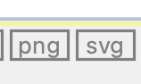

Use the two buttons to export the diagram as an SVG or PNG. A notification will give you more options to interact with the exported image:

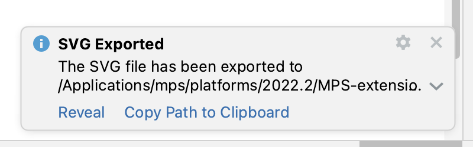{ width="500" }

#### Clear Stored Layout Information

When you store the layout data in the diagram, this button will delete the information from the model. Depending on your settings regarding auto-layout on init, the diagram will be auto-layouted the next time it is initialised or the layout information will just be gone:


#### Synchronize diagram with model only on opening

When the option `synchronize diagram with model only on opening` is enabled, the diagram is not updated automatically based on the model. The new diamond-shaped button has to be used to do this. The only time when the diagram is synchronized is when the diagram is initially initialized e.g. when creating the editor for a root node. The use case for this feature is that sometimes you want to edit the model in bulk before updating the diagram which can take a lot of time and disturb the editing experience.

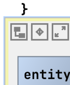

#### Editor Context Actions Menu: Show Diagram Actions

Some of the MPS actions that are available in diagrams, can also be found in a separate menu that can be opened from the editor context menu:

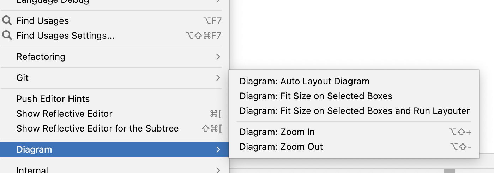{ width="500" }

### Layout Algorithms

The language provides different layout algorithm options for diagram. Each algorithm computes the graph with specialized edges, routing and direction styles.

The diagram languages uses the [Eclipse Layout Kernel](https://eclipse.dev/elk/) for layouting diagrams. Please read the page [Algorithms - Eclipse Layout Kernel™](https://eclipse.dev/elk/reference/algorithms.html) for more information about each single algorithm. The following algorithms are implemented:

- [ELK Box](https://eclipse.dev/elk/reference/algorithms/org-eclipse-elk-box.html)
    - Algorithm for packing of unconnected boxes, i.e. graphs without edges.
- [ELK DisCo](https://eclipse.dev/elk/reference/algorithms/org-eclipse-elk-disco.html) 
    - Arranges unconnected subgraphs while preserving their original layout. The subgraphs themselves are not automatically laid out.
    - Ideal for scenarios where you need to organize separate components without altering their internal structure.
- [ELK Fixed](https://eclipse.dev/elk/reference/algorithms/org-eclipse-elk-fixed.html)
    - Keeps the current layout unchanged, allowing optional coordinates for nodes and edge bend points.
    - Useful when you want to maintain a fixed arrangement or manually specify positions.
- [ELK Force](https://eclipse.dev/elk/reference/algorithms/org-eclipse-elk-force.html)
    - A force-based algorithm that simulates attractive and repulsive forces to balance node positions. Supports the Eades and Fruchterman-Reingold models.
    - Great for achieving visually balanced layouts based on physical analogies.
- [ELK Layered](https://eclipse.dev/elk/reference/algorithms/org-eclipse-elk-layered.html)
    - A layer-based algorithm for hierarchical graphs. Arranges nodes into layers, emphasizing edge direction. Supports various routing styles.
    - Suitable for node-link diagrams with ports and hierarchical structures.
- [ELK Mr. Tree](https://eclipse.dev/elk/reference/algorithms/org-eclipse-elk-mrtree.html)
    - Computes a spanning tree of the input graph and arranges nodes based on the resulting parent-children hierarchy.
    - Perfect for tree-like structures, emphasizing regularity in acyclic graphs.
- [ELK Radial](https://eclipse.dev/elk/reference/algorithms/org-eclipse-elk-radial.html)
    - Arranges nodes in concentric circles around a central point. Useful for radial diagrams or circular hierarchies.
    - Provides a clear visual representation of relationships.
- [ELK Randomizer](https://eclipse.dev/elk/reference/algorithms/org-eclipse-elk-random.html)
    - Introduces randomness to node positions. Useful for exploring different layout variations.
    - Can be handy during experimentation or visualization exploration.
- [ELK Rectangle Packing](https://eclipse.dev/elk/reference/algorithms/org-eclipse-elk-rectpacking.html)
    - Packs rectangles (representing nodes) into a container (graph canvas) while minimizing overlaps.
    - Ensures efficient use of available space.
- [ELK SPOrE Compaction](https://eclipse.dev/elk/reference/algorithms/org-eclipse-elk-sporeCompaction.html)
    - A compaction algorithm that optimizes node placement within a layer.
    - Helps reduce wasted space and improve readability.
- [ELK SPOrE Overlap Removal](https://eclipse.dev/elk/reference/algorithms/org-eclipse-elk-sporeOverlap.html)
    - Removes overlaps between nodes within a layer. Enhances clarity and aesthetics.
    - Useful for improving the visual quality of layered layouts.
- [ELK Stress](https://eclipse.dev/elk/reference/algorithms/org-eclipse-elk-stress.html)
    - Minimizes stress by adjusting node positions based on graph-theoretic distances. Useful for consistent geometric layouts.
    - Balances edge lengths and maintains readability.
- [ELK Top-down Packing](https://eclipse.dev/elk/reference/algorithms/org-eclipse-elk-topdownpacking.html)
    - Arranges nodes in a top-down manner, suitable for hierarchical structures. Supports aspect ratio control.
    - Ensures a clear hierarchy with minimal edge crossings.

Note that not all algorithms support sub-diagrams, self-loops, ports or even boxes. The default algorithm is [ELK Layered](https://eclipse.dev/elk/reference/algorithms/org-eclipse-elk-layered.html) which is sufficient for most use cases. Each page contains a section *Support options* that explains the available options, e.g. [Cycle Breaking Strategy](https://eclipse.dev/elk/reference/options/org-eclipse-elk-layered-cycleBreaking-strategy.html). The *Applies To* block explains where the option is available. The *parents* option means that the style attribute must be set in the inspector of (sub-)diagrams cells, *nodes* options must be set in diagram.box definitions and *cell* options must be set in
diagram.edge cells. Example: The style attribute of the cycle breaking strategy option of the layered algorithm is called diagram-layout-layered-cycle-breaking-strategy and needs to be set in the inspector of the diagram cell.

## Content

There are different types of contents you can add to the diagram: children, generic box queries, generic edge queries and nodesQuery.

#### Diagram Box

Boxes are the building blocks of diagrams. They can be connected with each other or their ports through edges. They support the following options:

- *id* is the identifier that can be necessary if you have multiple boxes for the same node. You can create new IDs for a node through `EndpointUtil.createIdForSNode(thisNode)`.
- *ports* defines the connectable small boxes that are located at the edge of the box.
- *preserve port order* instructs the layouter to not change the port order.
- *editor* sets some MPS cells as the content of the box.
- *shape* defines how the box is rendered in the diagram.
- *allow connections to box* enables connections with the box itself without the need for ports.
- *content* can be populated like the content of diagrams.
- *delete* is called when the box is deleted.
- *navigation targets* are nodes that can be opened through buttons in the box's buttons menu. They are meant as references of the current box that can be navigated to.
- *allow scaling* enables changes the size of the box (default: true).
- *annotation external* fetches annotations and create separate boxes for them.
- *drop handler* is a handler that checks if elements can be dropped on this element (*can drop(data)*). This handler also contains a method *drop(data)* that is execution when the drop happens.

## Additional Box Actions

- The `Fit size` action is available when a box is selected.
- A second button `Create connection` contains a submenu with all the defined connection creators. Use those buttons to create new connections.
- When the box has ports, there is an action "Reorder ports", to save the new port order in the model. Each port gets a port assigned based on the position at the box.

### Generic Box Query

They are used to add boxes to the diagram based on a list of parameters and support the following options:

- *parameter type* sets the type of the list of parameters.
- *query* returns a list of parameters or a single parameter.
- *id* is the identifier that can be necessary if you have multiple boxes for the same node. You can create new IDs for a node through `EndpointUtil.createIdForSNode(thisNode)`.
- *shape* defines how the box is rendered in the diagram.
- *ports* defines the connectable small boxes that are located at the edge of the box.
- *buttons* sets the context buttons that are visible when the box is selected.
- *preserve port order* instructs the layouter to not change the port order. 
- *editor* sets some MPS cells as the content of the box.
- *allow connections to box* enables connections with the box itself without the need for ports.
- *delete* is called when the box is deleted.
- *navigation targets* are nodes that can be opened through buttons in the box's buttons menu. They are meant as references of the current box that can be navigated to.
- *allow scaling* enables changes the size of the box (default: true).
- *drop handler* is a handler that checks if elements can be dropped on this element (*can drop(data)*). This handler also contains a method *drop(data)* that is execution when the drop happens.

The current object from the query is available through `parameterObject`.

## Edges

Edges are used to connect boxes or ports with each other. They support the following options:

- *id* is the identifier that can be necessary if you have multiple edges for the same node.
- *from* sets the source of the edge.
- *to* sets the target of the edge.
- *reverse* sets the source as the target of the edge and vice versa.
- *label* sets the text that describes the edge.
- *use annotations from parent in label*: If a model node had an attribute annotation and is used as an edge in a diagram, the attribute editor is added as an external box in the diagram. With this setting, the annotation is part of the edge label and thus also automatically layouted.
- *delete* is called when the edge is deleted.
- *can split* controls if the edge can be split and a new box be inserted.
- *curved* changes the style of the edge to curved. This information is considered by the auto layouter.
- *edge style (experimental)* changes the style of the edge to one of the [predefined ELK edge types](https://eclipse.dev/elk/reference/options/org-eclipse-elk-edge-type.html). Note: Setting this option currently breaks some functionality related to moving edges.
- *navigation targets* are nodes that can be opened through buttons in the box's buttons menu. They are meant as references of the current box that can be navigated to.
- *drop handler* is a handler that checks if elements can be dropped on this element (*can drop(data)*). This handler also contains a method *drop(data)* that is execution when the drop happens.
- *content* can be populated like the content of diagrams.

## Generic Edge Query

They are used to add edges to the diagram based on a list of parameters and support the following options:

- *parameter type* sets the type of the list of parameters.
- *query* returns a list of parameters or a single parameter.
- *id* is the identifier that can be necessary if you have multiple edges for the same node. You can use `parameterObject` to create an identifier if it is of type string.
- *from* sets the source of the edge.
- *to* sets the target of the edge.
- *reverse* sets the source as the target of the edge and vice versa.
- *label* sets the text that describes the edge.
- *use annotations from parent in label*: If a model node had an attribute annotation and is used as an edge in a diagram, the attribute editor is added as an external box in the diagram. With this setting, the annotation is part of the edge label and thus also automatically layouted.
- *delete* is called when the edge is deleted.
- *can split* controls if the edge can be split and a new box be inserted.
- *split* is the method that is called when the split happens. You can access the node to insert through *boxToInsert.getSNode()*.
- *curved* changes the style of the edge to curved. This information is considered by the auto layouter.
- *edge style (experimental)* changes the style of the edge to one of the [predefined ELK edge types](https://eclipse.dev/elk/reference/options/org-eclipse-elk-edge-type.html). Note: Setting this option currently breaks some functionality related to moving edges.
- *navigation targets* are nodes that can be opened through buttons in the box's buttons menu. They are meant as references of the current box that can be navigated to.
- *drop handler* is a handler that checks if elements can be dropped on this element (*can drop(data)*). This handler also contains a method *drop(data)* that is execution when the drop happens.

The current object from the query is available through `parameterObject`.

## Additional Edge Actions

Edges can be hidden by clicking on the button in the edge menu or by hiding all edges by clicking the *Hide All Edges* button in the box menu. There is a separate button *Show All Edges* to show all edges of a box again. The information about the visibility of an edge is saved in the model (in the layout annotation).

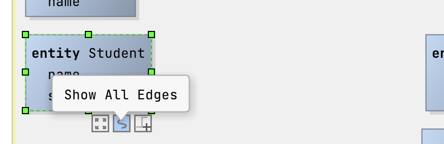{ width="500" }
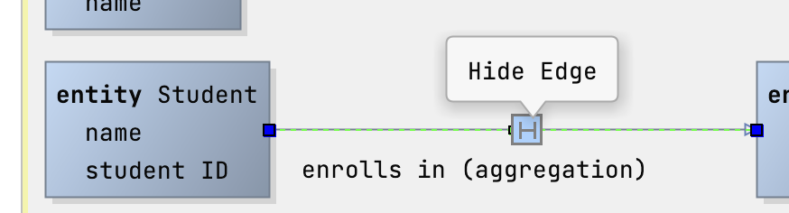{ width="500" }

### From and To Declaration

Those two declarations set the point where the edge begins (from) and ends (to). They have the following options:

- *target* sets the end point. It can be a *box*, a *port* or a conditional *if* expression.
- *can set target* checks if the target is valid. The parameter *targetDNode* refers to the internal representation of the target box in the diagramming library. The parameter *port* refers to the name of the target port and can be empty.
- *set target* is called to set the target.
- *shape* sets the shape of the endpoint of the connection.
- *shape size (px)* defines the size of the shape.
- *auto layout: allow any size* (deprecated, unused) tells the layouter, if the edge can be connected on any side of a box.
- *role cell*: sets the MPS cell used to visualize the endpoint.

## Child and nodesQuery

Existing children can be added through the code completion menu. They should have editors containing diagram box, diagram edge or diagram cells. To include arbitrary nodes, use a *nodesQuery* and return a sequence of nodes that serve as the content of the diagram.

## Ports

Ports can be declared statically or through a port *query* where you can return a list of objects/nodes in the query itself. The information can be used in the port declaration itself through `portObject`. A port has the following options:

- *label* declares a text next to the port that describes it.
- *shape* defines how the port is rendered in the diagram.
- *positionX* declares the horizontal position of the port. The value can go from 0 (left) to 1 (right). The default value is 0.
- *positionY* declares the vertical position of the port. The value can go from 0 (top) to 1 (bottom). The default value is 0.5 (center).
- *width* sets the width of the port.
- *height* sets the height of the port.
- *tooltip* is a tooltip with an embedded MPS cell that is shown when the mouse hovers over the port.

## Additional features

### Compartment cells

Compartment cells can be used as separators in diagram boxes and labels and have a size of 2x2.

### Cross-Navigation

The editor of the diagram cell now has a new option disable node editing which makes it possible to disable the MPS editor that opens when you double-click a node in the diagram. Do customize the click event when clicking an MPS cell in the editor (e.g. the box's content or the label of an edge), you can register a custom mouse listener for the [GlobalDiagramMPSCellClickListener](http://127.0.0.1:63320/node?ref=r%3A663468b2-7f77-448a-afd3-b1669ce5b4a7%28de.itemis.mps.editor.diagram.runtime.plugin%29%2F1742468285840696609&project=mps-extensions) extension point. To register a global diagram mouse listener, use the extension point [GlobalDiagramMouseListener](http://127.0.0.1:63320/node?ref=r%3A663468b2-7f77-448a-afd3-b1669ce5b4a7%28de.itemis.mps.editor.diagram.runtime.plugin%29%2F5458251120638842458&project=mps-extensions) instead:

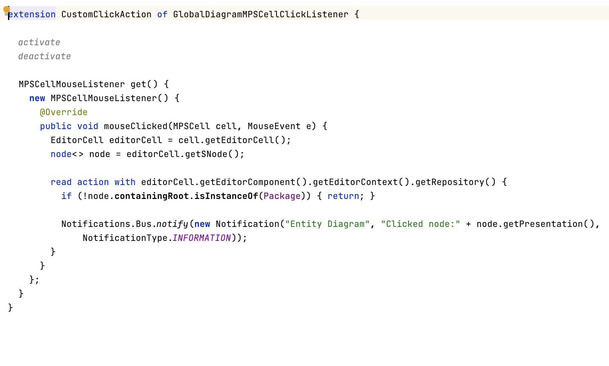{ width="500" }

In the demo, a notification is created, when you single-click an entity box:

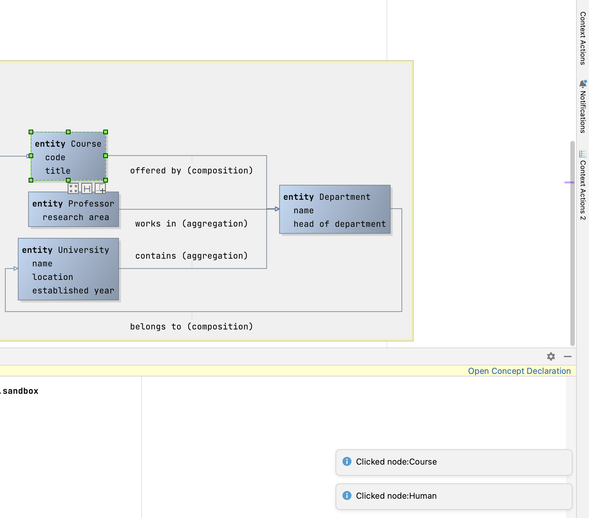{ width="500" }

To customize the click into the MPS cell, use the extension point [GlobalDiagramMPSCellClickListener](http://127.0.0.1:63320/node?ref=r%3A663468b2-7f77-448a-afd3-b1669ce5b4a7%28de.itemis.mps.editor.diagram.runtime.plugin%29%2F1742468285840696609) and implement the class [MPSCellMouseListener](http://127.0.0.1:63320/node?ref=r%3A663468b2-7f77-448a-afd3-b1669ce5b4a7%28de.itemis.mps.editor.diagram.runtime.plugin%29%2F1742468285840696610).

### Action: Switch All Port's Side

There are two actions `Switch All Port's Side Clockwise` and `Switch All Port's Side Counter-Clockwise` to move the ports to the next side of the box.

### Action: Flip All Port's Side Vertically

Use the actions `Diagram: Flip All Port's Side Vertically` and `Diagram: Flip All Port's Side Horizontally` to switch all ports to be on the opposite side (east-west, north-south).

### Smart Guide

When you move boxes, green guidelines will help you with aligning the boxes with other diagram elements.

## Example from Mbeddr

The following screenshots show component wiring and state machines that can be edited graphically.

{ width="800" }

This screenshot shows a few interesting features: you can embed diagrams anywhere in "text", you can use different shapes (at this point drawn by custom Java code), you can use various line styles, the framework supports ports (i.e., connection endpoints on the boxes), inside boxes you can use arbitrary MPS text (or other) editors, and the system also supports edge and endpoint labels. Port labels are also supported, but they are only shown if the mouse is "in the vicinity" of the port to not clutter the diagram. Below is a second screenshot of a bigger diagram:


This one illustrates that the approach scales to reasonable sizes, shows that zooming is supported and also demonstrates the auto layouting capability. The graphical notation also integrates with things such as tooltips. Below is another example diagram that shows a different language:

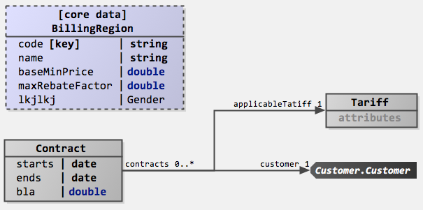

The definition of a graphical editor is based on the same "cell" abstraction used in other MPS editors: the language for defining editors contains additional cells that are then rendered as a diagram (diagram, diagram.box, diagram.edge). Similar to tables, these abstractions for defining graphical editors rely on queries to make sure that the structure of the graphical editor does not have to directly correspond to the structure of the AST (for example, in terms of ownership). The language also supports hierarchical diagrams, for example, in state machines.

To see example code, check out InstanceConfiguration and Statemachine in the [mbeddr repository](https://github.com/mbeddr/mbeddr.core).

## Sandboxes

The MPS-extensions project comes with a few sandboxes including the sandbox `de.itemis.mps.editor.diagram.demo.elk.sandbox`. You can find all the style sheet declarations by importing the corresponding style sheet: DiagramCoreAttributes, DiagramMPSAttributes, DiagramAlgorithmAttributes

To play around with ELK features in general, you can visit: https://rtsys.informatik.uni-kiel.de/elklive/examples.html

Please note that not all algorithms make sense with all diagrams. Most of the time, you still want to use the ELK layered algorithm because it has the most options and has support for self-loops, inside self-loops, multi-edges, edge labels, parts, compound nodes, and clusters. Some of them need manual layouting first. Please consult the ELK algorithms documentation for more information.

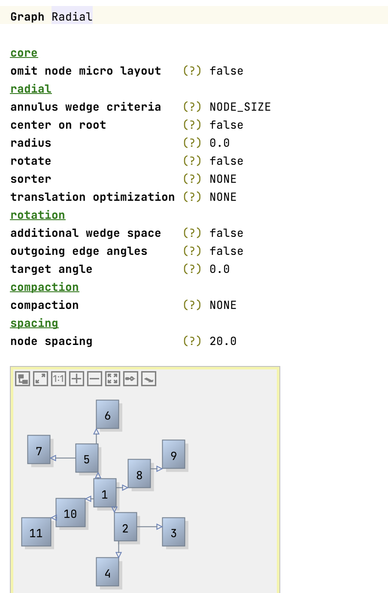{ width="500" }

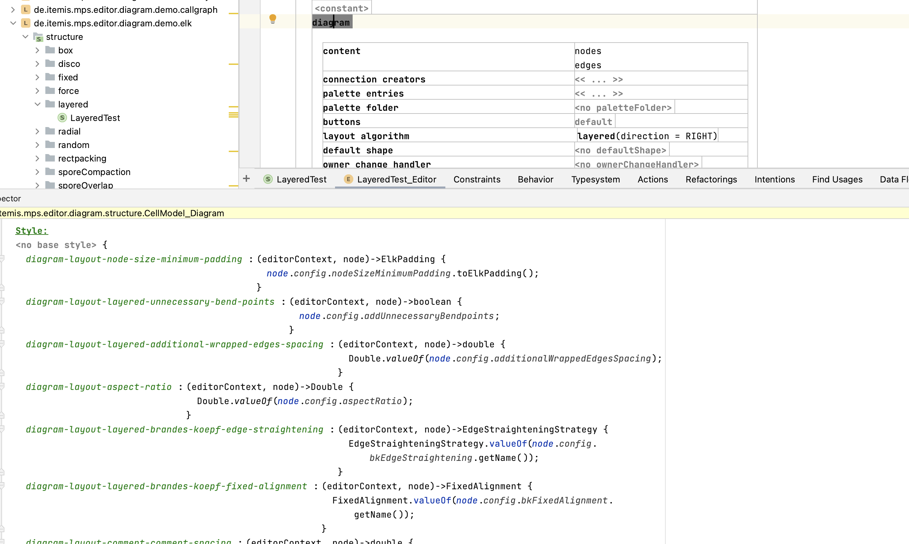{ width="800" }

## Interacting with diagrams programmatically:

Most diagram actions that can be executed from buttons can be found in [DiagramActionsUtil](http://127.0.0.1:63320/node?ref=r%3A7fc96130-6279-4a55-aeeb-422a6879539d%28de.itemis.mps.editor.diagram.runtime.jgraph%29%2F1129445411017062535). Diagram functionalities can be tested in editor tests. It is important to disable the synchronizer, so that changes are not written to the original model. When comparing positions and dimensions of diagram elements, keep in mind that they might change a bit because the auto-layouter is not fully deterministic. Example:

```java
RootDiagramECell diagramECell = EditorUtil.descendants(editor component.getRootCell(), RootDiagramECell.class).get(0); 
JGraphModelSynchronizer synchronizer = JGraphModelSynchronizer.getSynchronizer(diagramECell.getDiagramModel()); 
synchronizer.suspend({ => 
  mxCell diagramDCell = diagramECell.getDCell(diagramECell.getGraph()); 
  BoxDCell box1 = diagramDCell.getChildrenx().first as BoxDCell; 
  Bounds originalBounds = new  Bounds(44.0, 12.0, 68.0, 33.0); 
  TestUtils.boundsAreApproximatelyEqual(originalBounds, box1.getBoundsx()); 
  ThreadUtils.runInUIThreadAndWait({ => synchronizer.suspend({ => box1.setSizex(100, 100); }); }); 
  TestUtils.boundsAreApproximatelyEqual(new  Bounds(44.0, 12.0, 100.0, 100.0), box1.getBoundsx()); 
  ThreadUtils.runInUIThreadAndWait({ => synchronizer.suspend({ => box1.setPositionx(200, 200); }); }); 
  TestUtils.boundsAreApproximatelyEqual(new  Bounds(200, 200, 100.0, 100.0), box1.getBoundsx()); 
  ThreadUtils.runInUIThreadAndWait({ => synchronizer.suspend({ => diagramECell.getDiagramModel().getLayouter().layout(diagramECell.getGraph(), new  EmptyProgressIndicator()); }); }); 
  TestUtils.boundsAreApproximatelyEqual(originalBounds, box1.getBoundsx()); 
});
```

## Issues

There's a [meta issue](https://github.com/JetBrains/MPS-extensions/issues/120) for known issues.

## Blog posts

- [JetBrains MPS: The Diagram Language | tillschallau.de](https://tillschallau.de/mps/jetbrains-mps-the-diagram-language/)