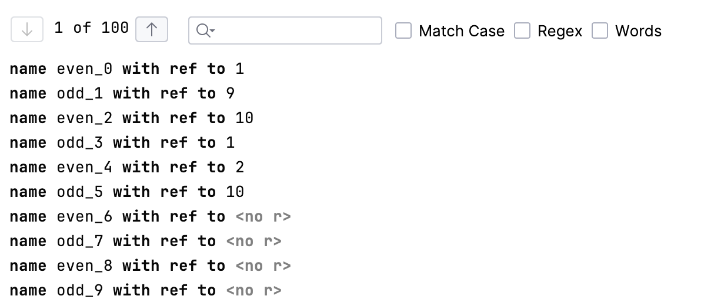

# Pagination

This language adds a new editor cell `paginate` that can split up list of nodes into pages that can be shown individually in the editor:

## Features

- Use the up and down arrows to navigate to the next page or enter a page number directly.
- You can search for elements directly through the search bar.
      - **Match Case** activates case-sensitive matching of terms
      - **Regex** activates [regular expression](https://regex101.com/) support in the search bar.
      - **Words** activates search for a whole word within the element.

## Editor Cell

The editor cell itself needs a reference to the list of node and additionaly supports to set the size of an individual page through *with page size*. The default size is 1.