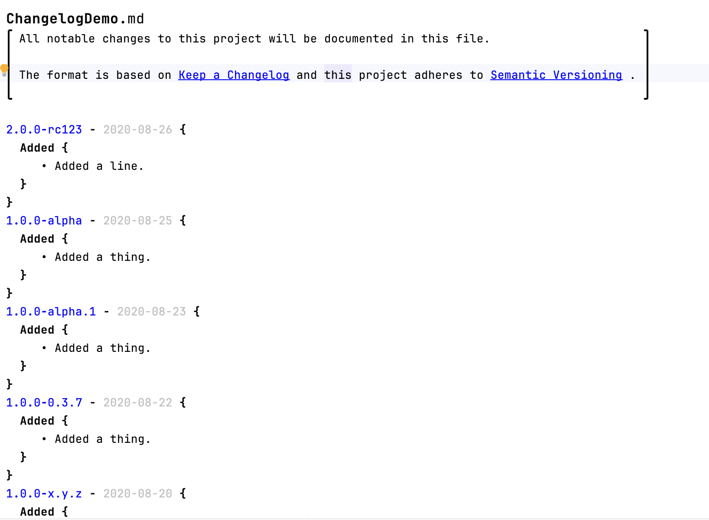
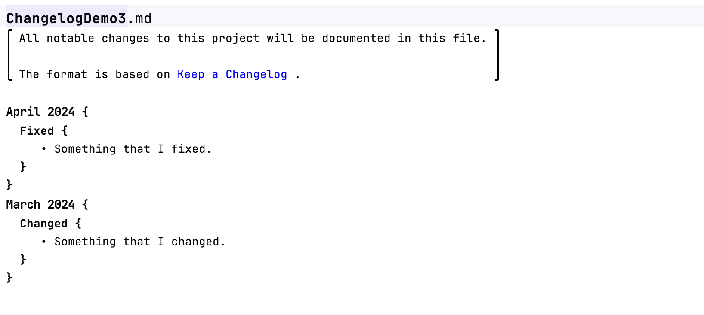

# Changelog

This language allows to create changelogs in the Markdown format. They can be written in the
[semantic versioning](https://semver.org/spec/v2.0.0.html) format:

A month and year based format is also supported:

Changes itself are written in the [keepachangelog](https://keepachangelog.com/en/1.1.0/) format. The following types of changes exist:

- **Added** for new features
- **Changed** for changes in existing functionality
- **Deprecated** for soon-to-be removed features
- **Removed** for now removed features
- **Fixed** for any bug fixes
- **Security** in case of vulnerabilities

The following special nodes can be used in the descriptions:

- **@node** reference a node
- **@model** reference a model
- **@module** reference a module

Due to the limitation of the text language, there is a separate intention `Combine Multiple Elements Without Spaces` to remove spaces between elements. Select multiple elements to make this intention visible.