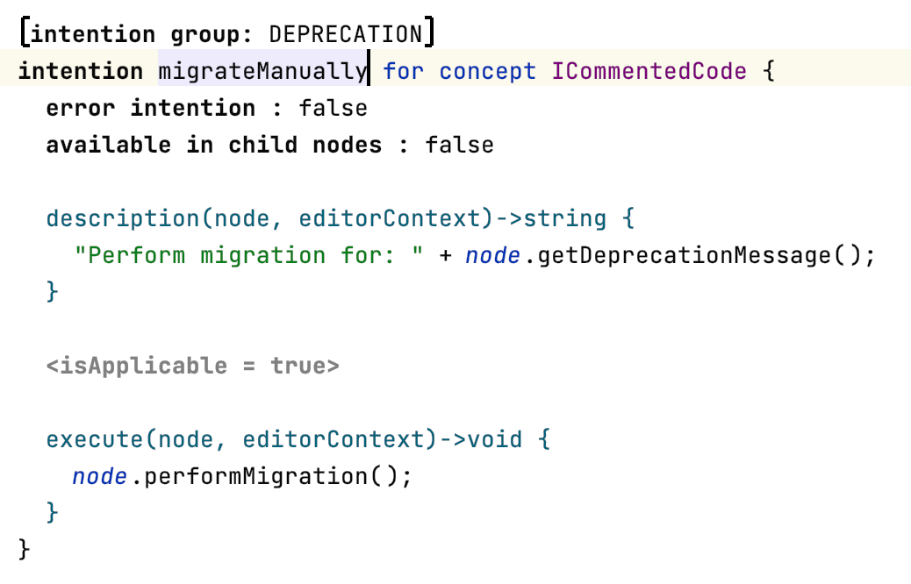

# Intentions Menu

**Language Namespace :** `com.mbeddr.mpsutil.intentions`

A language that adds support for grouping intentions. Invoke the intention `Toggle Group Annotation` to add it to a group.
The intentions will be grouped together if they use the same label in the annotation.

