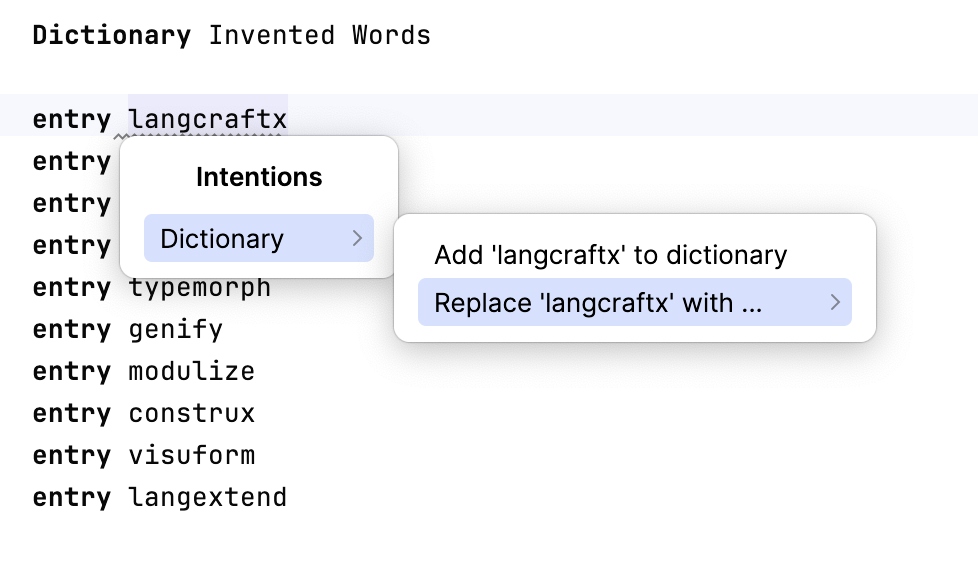

# Spell check

This plugin adds a new entry `Dictionary` to the intentions menu where you can add unknown words to the MPS dictionary or replace the current selected text with a known word from the dictionary:

You can also add words to the dictionary by creating a new dictionary root node and adding
entries to it. A second type of root node predefined dictionary allows to install existing dictionaries in the [hunspell](https://github.com/hunspell/hunspell) format.
Some existing dictionaries for different languages can be found at https://github.com/wooorm/dictionaries